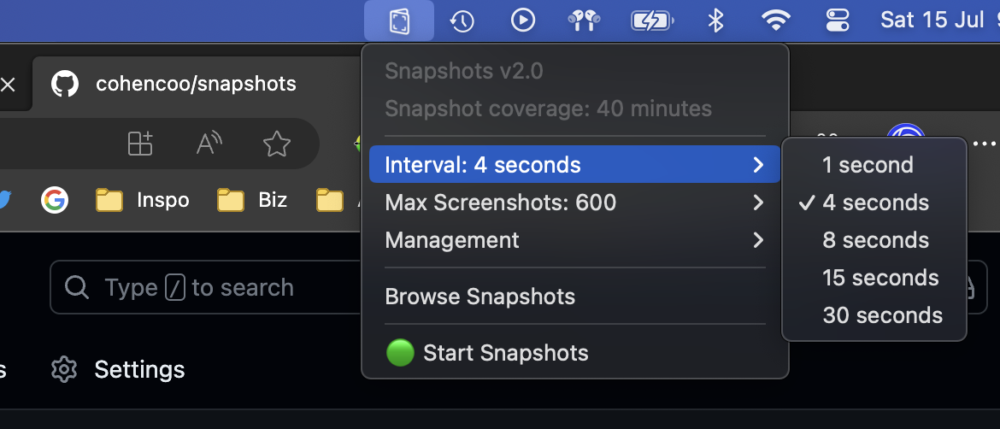
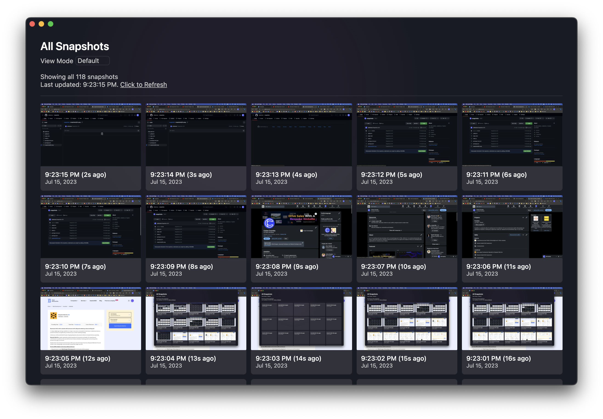

  

# Snapshots v2.0

Snapshots is your ultimate photographic screen capture companion, designed to help you recall past moments and capture important information effortlessly. Developed with developers, students, and professionals in mind, Snapshots provides an intuitive solution to store and review your screen activity, ensuring you never miss a crucial detail again.

## Key Features

-   **Seamless Screen Capture:** Snapshots allows you to capture your screen at predefined intervals, providing a continuous record of your activity. Whether you need to recall a code snippet, find a lost file, or remember an important piece of information, Snapshots has your back.

-   **Effortless Retrieval:** Say goodbye to the frustration of misplaced files or forgotten actions. Snapshots stores all your screen captures securely, enabling you to easily access and review your past activity whenever you need it. It's like having a photographic memory for your screen!

-   **Privacy-Oriented Design:** Unlike traditional screen recording tools that explicitly notify users, Snapshots operates silently in the background without any intrusive warnings. Your privacy is paramount, and Snapshots ensures that you capture your screen discreetly and naturally.

-   **Enhance Productivity:** With Snapshots, you can streamline your development process, improve accuracy in schoolwork, and quickly retrieve lost information. Spend less time searching and more time focusing on what truly matters.

## Using in Menubar Tray

## Browsing Snapshots

